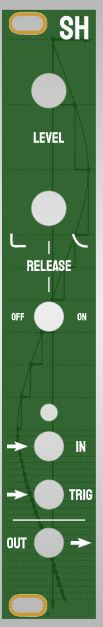
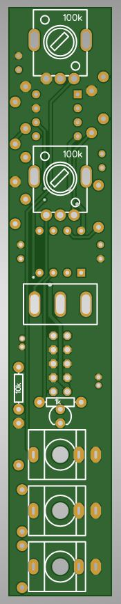

# HAGIWO 47 - Sample and Hold Eurorack Module

This is a 4HP eurorack PCB for the HAGIWO sample and hold.
For more info on the module, see:
https://www.youtube.com/watch?v=DoiZ9PZacQo

 

## Status: Confirmed working!

## Hardware / PCBs
The gerbers folder contains files for one panel pcb and one circuit pcb. 
Build is fairly easy and straightforward, just order with standard settings from
jlcpcb.com or another pcb service of your choice.

BOM can be found as a csv file in the repo.

Build is fairly straight forward, not much to say here. 